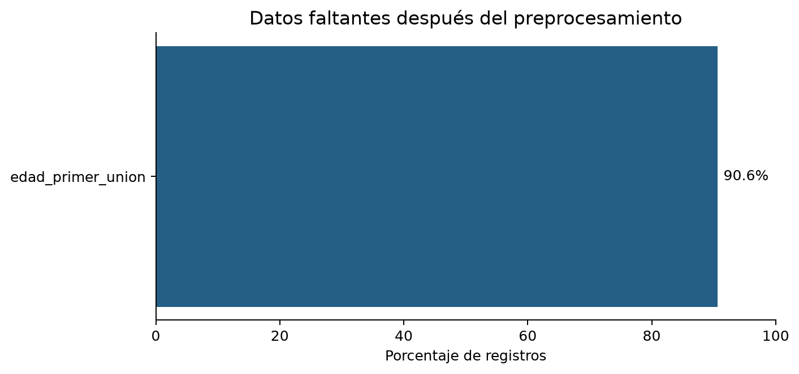
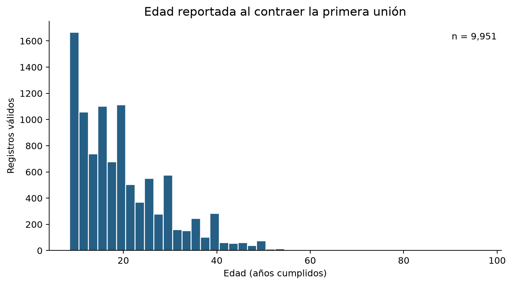
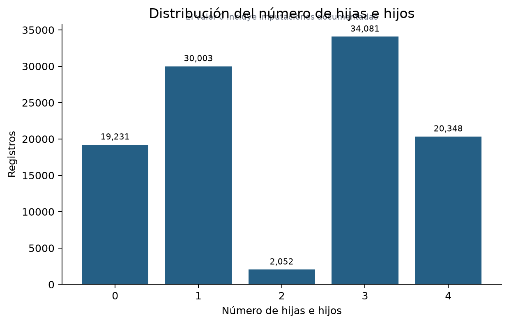
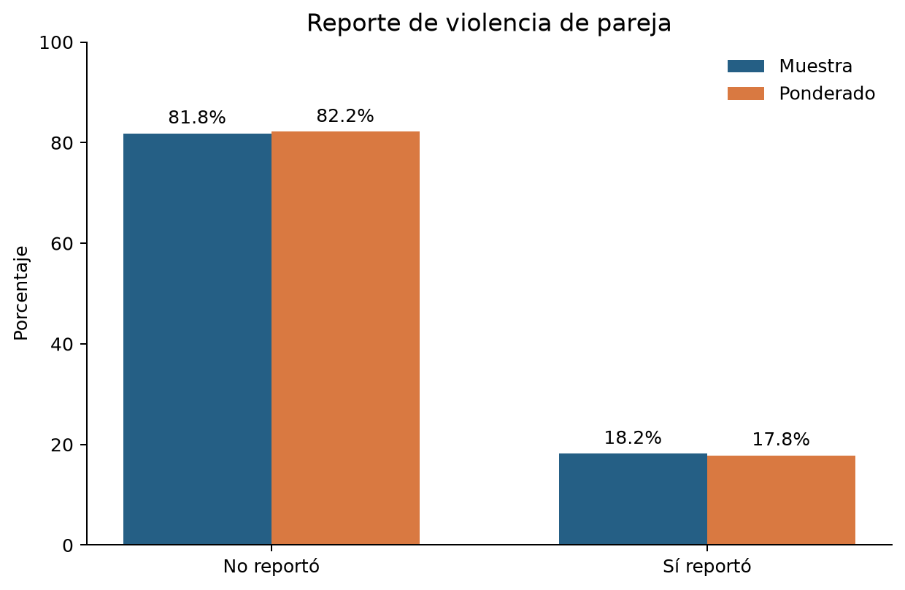
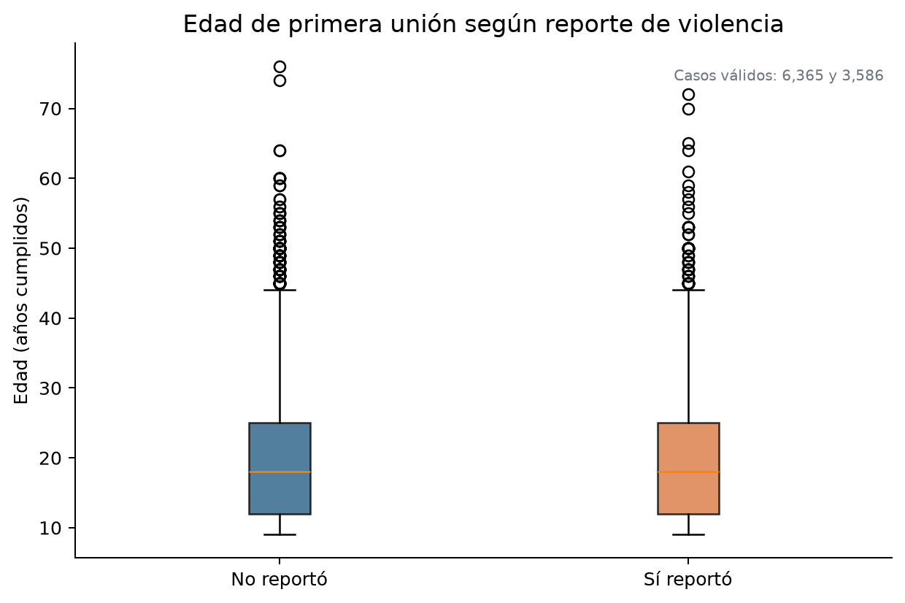
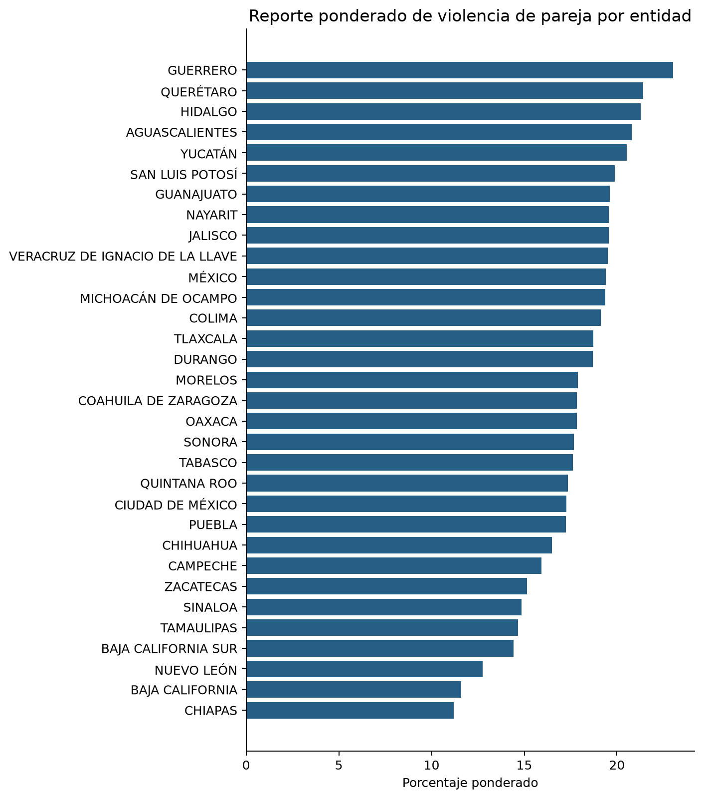

# Práctica 3: arquitectura, preprocesamiento y análisis exploratorio de ENDIREH 2021

**Curso:** Almacenes y Minería de Datos  
**Caso de estudio:** violencia contra las mujeres, ENDIREH 2021  
**Framework seleccionado:** Polars 1.44.2  
**Lenguaje:** Python 3.13

## Resumen ejecutivo

Se construyó un proyecto reproducible para analizar un archivo consolidado de la Encuesta
Nacional sobre la Dinámica de las Relaciones en los Hogares (ENDIREH) 2021. El archivo
original contenía 110,127 registros y 24 columnas. El pipeline, desarrollado con Polars,
eliminó 4,374 duplicados exactos y 38 duplicados que surgieron después de normalizar
códigos equivalentes. El conjunto procesado tiene 105,715 registros, 31 columnas y cero
duplicados.

El principal problema de calidad fue `edad_primer_union`: después de aplicar el rango y
los códigos del descriptor oficial, solo quedaron 9,951 observaciones válidas. Por esa
razón no se imputó esta variable. Su media simple fue 19.97 años y su media ponderada
19.74 años. El porcentaje que reportó violencia de pareja fue 18.2% en la muestra y
17.8% al ponderar por el factor de expansión. Estos resultados son descriptivos y no
establecen relaciones causales.

## 1. Objetivo y fuente de información

El objetivo fue organizar un proyecto de datos reproducible, seleccionar un framework,
limpiar el conjunto consolidado, clasificar sus variables y calcular medidas de
localización y variabilidad antes de cualquier modelado.

La fuente es la ENDIREH 2021 del Instituto Nacional de Estadística y Geografía (INEGI).
El CSV original se conserva sin modificaciones en `data/data-raw/` y se excluye del
repositorio Git. Para interpretar los códigos especiales se consultó la estructura oficial
de la base de datos de ENDIREH 2021.

## 2. Arquitectura del proyecto

```text
proyecto-endireh-violencia/
├── config/
│   └── rutas.py
├── data/
│   ├── data-raw/
│   ├── data-processed/
│   ├── data-input-model/
│   └── data-model/
├── notebooks/
│   ├── 01_eda.ipynb
│   └── 02_medidas_descriptivas.ipynb
├── reports/
│   └── figures/
├── src/
│   ├── analysis/
│   ├── cleaning/
│   ├── models/
│   └── visualization/
├── README.md
└── requirements.txt
```

La separación impide sobrescribir datos originales, distingue código productivo de
notebooks exploratorios y permite regenerar tanto el Parquet limpio como las gráficas.
`config/rutas.py` centraliza todas las rutas para evitar valores dependientes del equipo.
Las versiones exactas están fijadas en `requirements.txt` y las dependencias se instalaron
en un entorno virtual `.venv`.

## 3. Comparación y selección del framework

| Criterio | pandas | Polars | PySpark |
|---|---|---|---|
| Diseño | DataFrames sobre NumPy; API madura | Motor en Rust, ejecución paralela y API eager/lazy | DataFrames distribuidos sobre Apache Spark |
| Escala adecuada | Datos pequeños o medianos en una máquina | Datos medianos o grandes en una máquina | Datos que requieren varias máquinas |
| Ventaja principal | Compatibilidad y ecosistema histórico | Paralelismo, expresiones y optimización lazy | Tolerancia y procesamiento distribuido |
| Costo operativo | Bajo | Bajo | Alto: requiere JVM y normalmente un clúster |
| Adecuación al CSV | Suficiente | Alta | Desproporcionada |

Se eligió **Polars** porque el archivo tiene aproximadamente 10.2 MB y 110 mil filas:
cabe con amplitud en memoria y no justifica la infraestructura de Spark. Polars permite
mantener un pipeline expresivo, aprovechar varios núcleos y utilizar evaluación lazy si el
volumen crece. pandas también resolvería el problema, pero Polars cumple el objetivo
académico de utilizar un framework moderno y se usó consistentemente en la carga,
limpieza, agrupación y cálculo. NumPy se empleó exclusivamente para la media ponderada.

## 4. Preprocesamiento

### 4.1 Auditoría de limpieza

| Operación | Resultado |
|---|---:|
| Filas originales | 110,127 |
| Duplicados crudos eliminados | 4,374 |
| Duplicados adicionales tras normalizar | 38 |
| Filas finales | 105,715 |
| Columnas finales, incluidas banderas de auditoría | 31 |
| Celdas de texto con codificación reparada | 58,762 |

### 4.2 Reglas aplicadas

- `edad_primer_union`: se conservaron valores de 9 a 97; 0-8, 98 y 99 se
  transformaron en nulos. Los códigos 98 y 99 significan "no recuerda" y "no
  especificado". No se imputó la edad porque hacerlo en 90.6% de los registros
  fabricaría la mayor parte de la distribución.
- `num_hijos`: los blancos se convirtieron en cero y se agregó una bandera de
  imputación. Se imputaron 19,231 registros.
- `ingreso_pareja`: `999998` (no sabe) y `999999` (no especificado) se convirtieron
  en nulos. `999997` se conservó como ingreso censurado, es decir, igual o mayor a esa
  cantidad, y se marcó con una bandera.
- Para parejas que no trabajan, el ingreso faltante se trató como cero estructural.
  Para parejas que sí trabajan y tenían falta de respuesta, se utilizó la mediana por
  entidad; la mediana nacional de respaldo fue 1,500.
- Los nombres geográficos con codificación dañada se repararon selectivamente; las
  cadenas que ya eran correctas se conservaron.
- Las claves, indicadores binarios, año y factor de expansión se convirtieron a tipos
  enteros compactos. El resultado se guardó como Parquet con compresión Zstandard.

Las banderas agregadas permiten distinguir un dato informado de uno corregido,
censurado o imputado. Esta trazabilidad evita presentar la imputación como observación
original.

## 5. Clasificación de variables

| Variable | Tipo | Justificación |
|---|---|---|
| `edad_primer_union` | Cuantitativa discreta | Edad en años cumplidos; admite operaciones aritméticas |
| `num_hijos` | Cuantitativa discreta | Conteo de hijas e hijos |
| `nom_entidad` | Cualitativa nominal | Identifica una entidad sin orden inherente |
| `nivel_escolaridad` | Cualitativa ordinal | Sus niveles son categorías ordenables, no magnitudes |
| `estado_civil_desc` | Cualitativa nominal | Categorías sin escala numérica |
| `sufrio_violencia_pareja` | Cualitativa nominal dicotómica | No reportó / sí reportó |
| `factor_expansion` | Cuantitativa continua usada como ponderador | Representa a cuántas mujeres de la población corresponde cada registro |

## 6. Análisis exploratorio



Después de la limpieza, la edad de primera unión conserva 90.6% de valores faltantes.
Esta limitación se muestra en lugar de ocultarse mediante una imputación masiva.



La distribución de edad es asimétrica y presenta valores extremos. Se basa en 9,951
casos válidos. El patrón y la moda de 10 años requieren interpretación prudente y no
deben extrapolarse a todos los registros.



La categoría cero corresponde a valores imputados conforme a la regla documentada; por
ello cualquier estadística de `num_hijos` debe mencionar esta intervención.



El 18.2% de la muestra reportó violencia de pareja. Al usar el factor de expansión, la
estimación es 17.8%. La estimación ponderada es la apropiada cuando el objetivo es
describir la población representada y no solo las respuestas observadas.



Ambos grupos muestran mediana e IQR semejantes. El gráfico no prueba que la edad de
primera unión cause diferencias en violencia; además, solo incluye casos con edad válida.



Las diferencias entre entidades pueden depender de composición demográfica, patrones de
respuesta y diseño muestral. No deben interpretarse como atributos intrínsecos de las
mujeres o de las poblaciones estatales.

## 7. Medidas de localización

| Variable | n válido | Media simple | Media ponderada | Mediana | Moda | P10 | Q1 | Q3 | P90 |
|---|---:|---:|---:|---:|---:|---:|---:|---:|---:|
| Edad de primera unión | 9,951 | 19.97 | 19.74 | 18 | 10 | 10 | 12 | 25 | 34 |
| Número de hijos | 105,715 | 2.06 | 1.85 | 3 | 3 | 0 | 1 | 3 | 4 |

La diferencia entre media simple y ponderada aparece porque las observaciones representan
distintas cantidades de mujeres. La media ponderada de edad es 0.23 años menor; aunque
la diferencia es pequeña, la ponderada es conceptualmente preferible para describir la
población nacional representada por la encuesta.

## 8. Medidas de variabilidad

| Variable | Rango | Varianza muestral | Desviación estándar | CV | IQR |
|---|---:|---:|---:|---:|---:|
| Edad de primera unión | 67 | 94.02 | 9.70 | 48.56% | 13 |
| Número de hijos | 4 | 2.10 | 1.45 | 70.36% | 2 |

El CV de la edad indica dispersión considerable en relación con la media. El rango es
sensible a los extremos; el IQR de 13 años describe de forma más robusta el 50% central.
El CV de `num_hijos` también refleja los ceros imputados, por lo que no debe presentarse
como si todos los valores fueran observados.

### Comparación por reporte de violencia

| Variable | Reportó violencia | n válido | Media | Media ponderada | Mediana | DE | CV | IQR |
|---|---|---:|---:|---:|---:|---:|---:|---:|
| Edad de primera unión | No | 6,365 | 20.10 | 19.95 | 18 | 9.83 | 48.92% | 13 |
| Edad de primera unión | Sí | 3,586 | 19.73 | 19.36 | 18 | 9.44 | 47.87% | 13 |
| Número de hijos | No | 86,516 | 2.01 | 1.80 | 3 | 1.47 | 72.74% | 2 |
| Número de hijos | Sí | 19,199 | 2.27 | 2.12 | 3 | 1.36 | 59.89% | 2 |

El CV de edad fue ligeramente menor entre quienes reportaron violencia. Las medianas y
los IQR fueron iguales. Las diferencias son descriptivas y pequeñas, y la ausencia de
edad en gran parte de la base impide conclusiones fuertes.

## 9. Cuestionario

### 1. Consideraciones éticas

El equipo debe proteger la confidencialidad, evitar intentos de reidentificación, usar
lenguaje centrado en las experiencias reportadas y no culpabilizar a las mujeres. Debe
distinguir asociación de causalidad, comunicar incertidumbre y faltantes, considerar el
diseño muestral y evitar rankings estigmatizantes. Las visualizaciones deben incluir
denominadores, ponderaciones y limitaciones. Los resultados agregados no sustituyen la
voz ni el contexto de las personas que vivieron violencia.

### 2. Diferencia entre media simple y ponderada

La media simple asigna el mismo peso a cada registro; la ponderada multiplica cada edad
por el número de mujeres que representa ese registro. Difieren cuando la composición y
los factores no son uniformes. En estos datos fueron 19.97 y 19.74 años,
respectivamente. Para describir la población representada debe reportarse la ponderada,
acompañada del tamaño de casos válidos y la alta proporción faltante.

### 3. Hipótesis ante un CV mayor en el grupo con violencia

Si el CV fuera considerablemente mayor, una hipótesis sería que ese grupo reúne
trayectorias de unión más heterogéneas. `nivel_escolaridad` ayudaría a explorar si la
variabilidad cambia al comparar mujeres con contextos educativos semejantes; también
sería pertinente controlar `estado_civil_desc`. En los resultados observados el supuesto
no se cumplió: el CV fue 47.87% frente a 48.92%, por lo que no corresponde afirmar esa
hipótesis como hallazgo.

### 4. Media simple contra media ponderada

Esta pregunta repite el contenido de la pregunta 2. La media ponderada debe privilegiarse
para describir la población nacional representada; la simple describe la muestra analizada.

### 5. CV de edad y violencia

Esta pregunta repite el escenario de la pregunta 3. Una posible explicación hipotética
sería la heterogeneidad de trayectorias educativas y conyugales, evaluable con
`nivel_escolaridad` o `estado_civil_desc`. Sin embargo, el patrón hipotético no aparece
en esta base y no debe presentarse como resultado.

## 10. Conclusiones

La arquitectura separa datos crudos, productos procesados, código y notebooks. Polars
resultó adecuado para el volumen y permitió construir un pipeline reproducible y
auditable. La limpieza mostró que transformar códigos especiales sin consultar el
descriptor habría sesgado los resultados. El factor de expansión modificó ligeramente
las estimaciones y debe utilizarse al describir la población.

La principal limitación es la ausencia de edad de primera unión en 90.6% del conjunto
procesado. Por ello las medidas de esa variable describen los casos válidos ponderados,
no garantizan ausencia de sesgo por falta de respuesta y no deben interpretarse de manera
causal.

## Referencias

- INEGI. *Encuesta Nacional sobre la Dinámica de las Relaciones en los Hogares 2021*.
  https://www.inegi.org.mx/programas/endireh/2021/
- INEGI. *ENDIREH 2021. Estructura de la base de datos*.
  https://www.inegi.org.mx/contenidos/programas/endireh/2021/doc/endireh2021_fd.pdf
- Polars. *User Guide*. https://docs.pola.rs/
- pandas. *User Guide*. https://pandas.pydata.org/docs/user_guide/
- Apache Spark. *PySpark documentation*. https://spark.apache.org/docs/latest/api/python/
- DrivenData. *Cookiecutter Data Science*.
  https://cookiecutter-data-science.drivendata.org/
